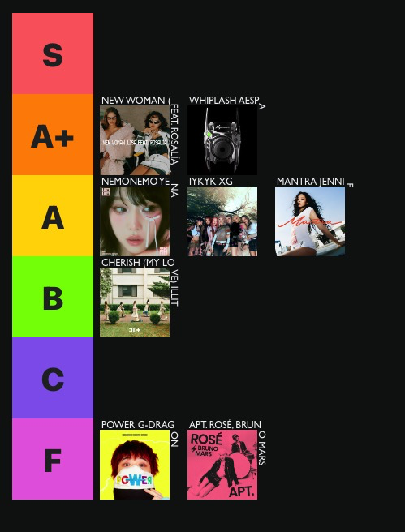

# spotify tier list
Create your tier list using a Spotify playlist.
[Try Here↗](https://tier-spotify.pages.dev/).

## Before You Start, You Need to Prepare
### - A Spotify Playlist ID
You can find this ID in the copied link. Any playlist except for "Liked Songs" can be shared, and the ID will be included in that string.

### - Spotify Bearer Token
This step can be a bit complicated, but once you have access to the [Spotify Developer page](https://developer.spotify.com/documentation/web-api/reference/get-playlist), you can capture the token using your browser's developer tools.

Have fun!
